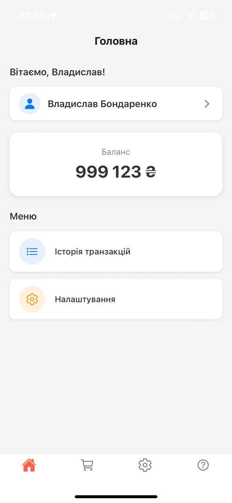
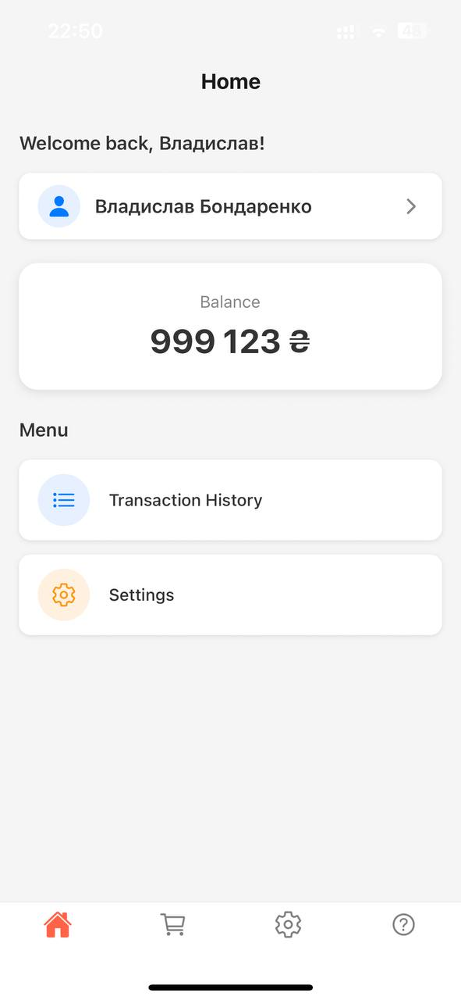
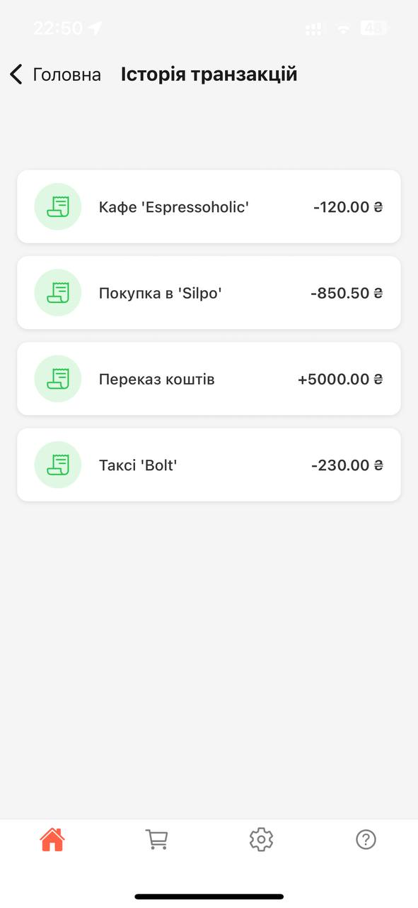
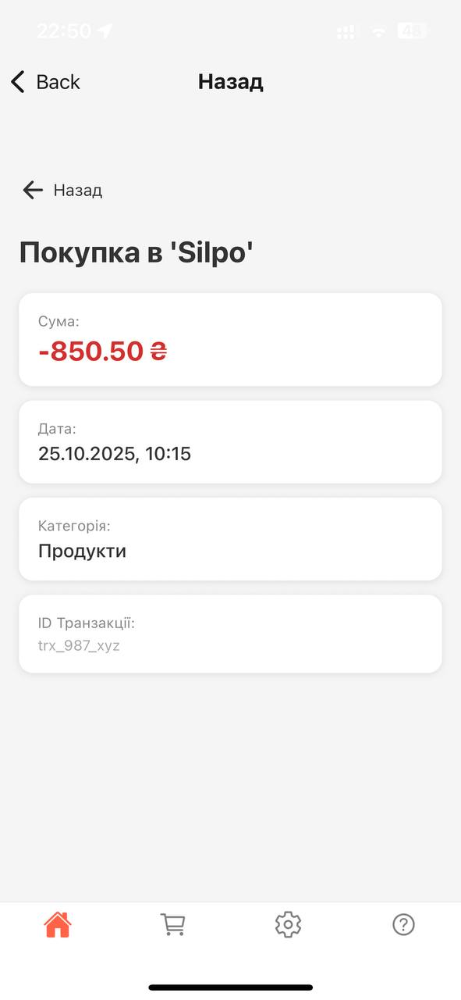

# V-Bank Mobile App 📱

Мобільний додаток для банкінгу, розроблений на **React Native** з використанням **Expo SDK**. Проєкт демонструє роботу з нативною навігацією, контекстом користувача та багатомовністю.

Mobile banking application built with **React Native** and **Expo**. The project focuses on navigation patterns, user state management, and internationalization.

---

## 📸 Screenshots / Скріншоти

<p align="center">
  
  
  
</p>
<p align="center">
  
  
</p>

---

## 🚀 Основні функції / Key Features

- **Native Navigation**: Використання `@react-navigation/native-stack` для нативних переходів між екранами.
- **Localization (i18n)**: Підтримка української та англійської мов через `i18next`.
- **Global State**: Керування балансом та даними профілю через **React Context API**.
- **UI/UX**: Консистентні відступи, заголовки та іконографіка (**Ionicons**).
- **Transactions**: Список транзакцій з деталізацією та категоріями.

---

## 🛠 Технології / Tech Stack

| Feature          | Technology                      |
| :--------------- | :------------------------------ |
| **Framework**    | Expo / React Native             |
| **Language**     | TypeScript                      |
| **Navigation**   | React Navigation (Stack & Tabs) |
| **Localization** | react-i18next                   |
| **Icons**        | Expo Vector Icons               |

---

## 📂 Структура проєкту / Project Structure

- `src/context` — логіка стану користувача та балансу.
- `src/screens` — екрани додатку (Home, Profile, Transactions, Settings).
- `src/navigation` — конфігурація стеків та стилі хедера.
- `src/localization` — JSON файли з перекладами та ініціалізація i18n.
- `assets/screenshots` — візуальна документація інтерфейсу.

---

## 📦 Встановлення та запуск / Installation

1.  **Клонувати репозиторій / Clone**:

    ```bash
    git clone [https://github.com/vladrlex/v-bank-mobile-app.git](https://github.com/vladrlex/v-bank-mobile-app.git)
    cd v-bank-mobile-app
    ```

2.  **Встановити залежності / Install**:

    ```bash
    npm install
    ```

3.  **Запустити / Start**:
    ```bash
    npx expo start
    ```

---

## 🧑‍💻 Автор / Author

**Vladyslav** - [vladrlex](https://github.com/vladrlex)
